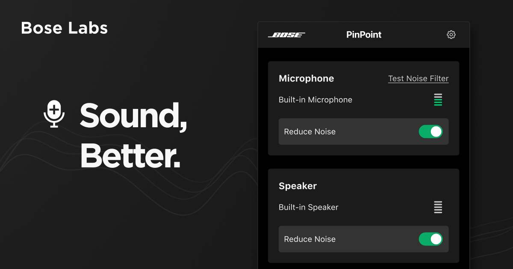

# Bose PinPoint (iOS)

> An extension for Agora

  

  

Bose PinPoint reduces unwanted background noise by using AI built on deep neural networks,trained bythousands of hours of audio. And it’s always improving, thanks to ongoing training from Bose. The PinPoint extension embeds directly into your Agora application at the app level giving you complete controlon how your users interact with it. With the PinPoint extension your users can communicate loud and clear without the interruptions of dogs barking, traffic rushing by or background chatter in a café. 

### Extension Integration Overview

The Bose PinPoint Extension for Agora is the simplest and most effective way to reduce unwanted noise from Agora calls. It processes audio locally and can be used to reduce everything other than voice on outgoing audio. It cleans audio both when someone is speaking, as well as when no one is speaking, meaning it can also be used to provide a robust signal for voice activity detection. The filter can be turned on and off programmatically to control when the original signal is sent vs. the voice-only signal. To use the noise filter extension, you just need to enable it by calling [agoraKit enableExtensionWithVendor:@"Bose" extension:@"PinPoint" enabled:YES].

### Extension Features Overview

When the extension is enabled and it successfully authenticates, the noise filter will start running and clean the audio signal. Use the enableExtensionWithVendor method to enable and disable the extension. Use the setExtensionPropertyWithVendor method to pass in the authentication token. The extension sends you events about the authentication status. Note that currently, it only filters the local microphone input. All users will experience noise-reduced audio so long as all other users have the extension turned on (default option). The ability to filter audio at other points in the audio pipeline may be supported by this extension in future. Otherwise the Bose PinPoint SDK is available for download separately for more complex projects. The same extension currently supports both iOS and Android projects.

[Click here for full documentation](https://console.agora.io/marketplace/extension/introduce?serviceName=bose).

## Installation

Add the URL of this repository to your Xcode 12+ Project.

Go to _File > Swift Packages > Add Package Dependency_, and paste in the link to this repository:

`https://github.com/AgoraIO-Community/Extension-Bose-PinPoint-iOS.git`

